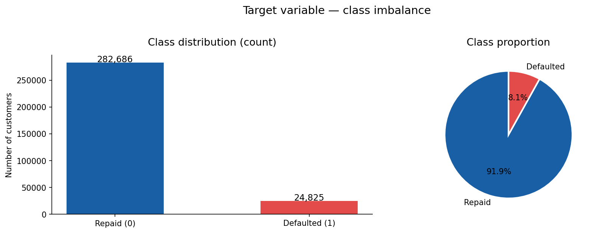
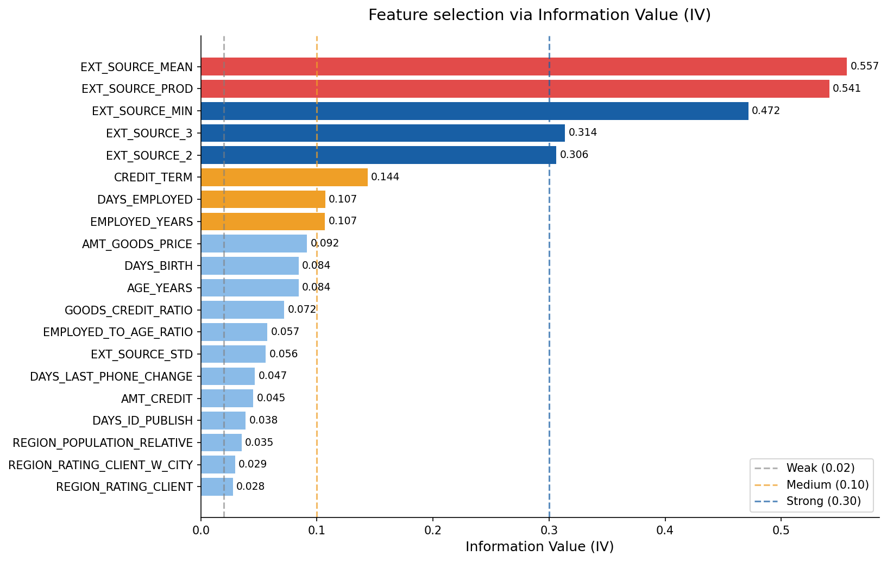
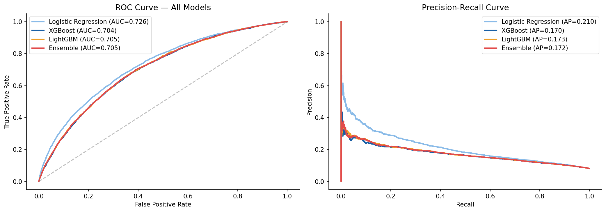
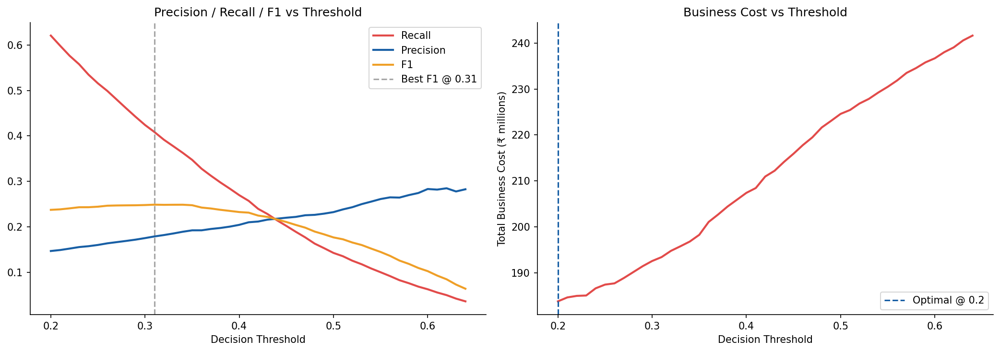
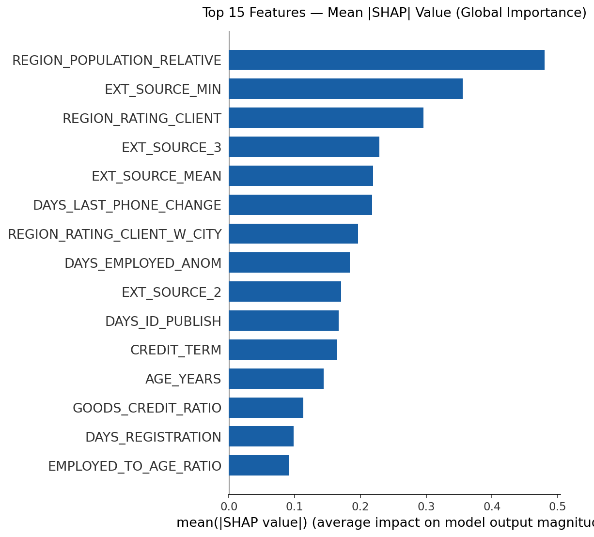
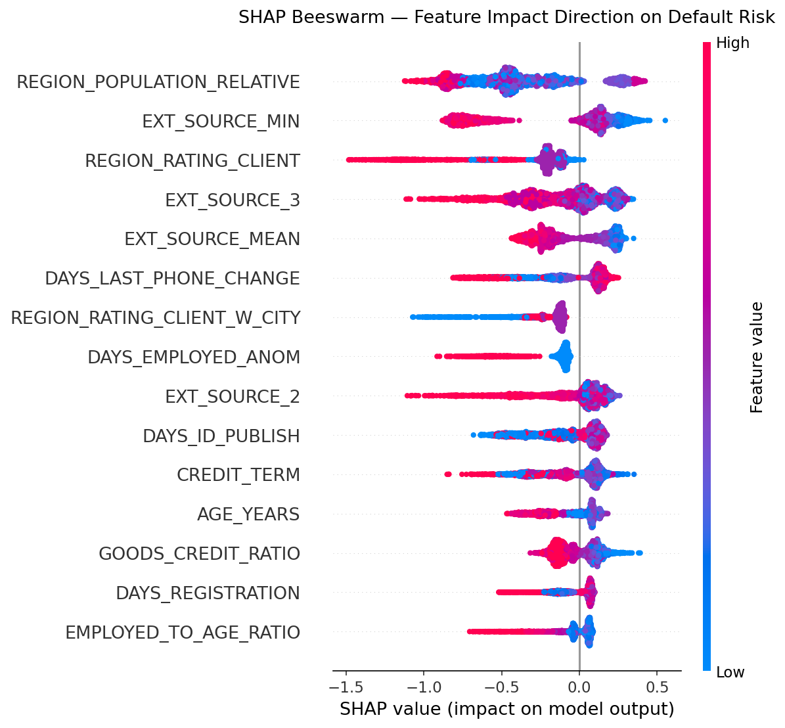
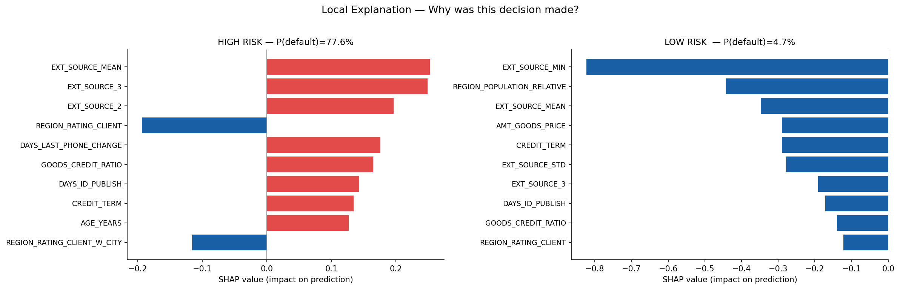
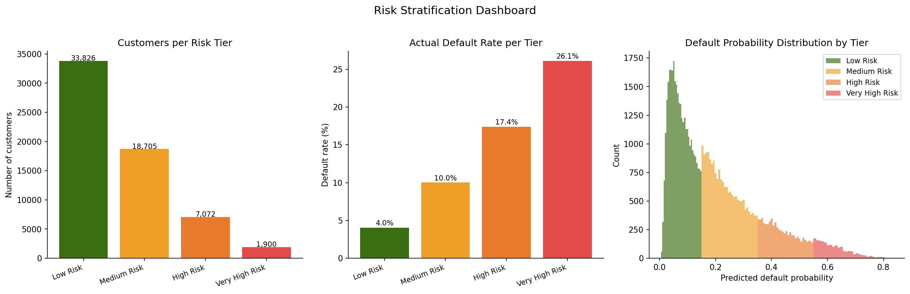

# 💳 Credit Risk & Probability of Default Prediction Model


> A production-grade credit default classification model built on 307,511 loan records. Engineered domain-specific financial features, handled severe class imbalance using SMOTE, and applied Weight of Evidence (WoE) / Information Value (IV) for feature selection — standard techniques in banking credit scorecards. Model decisions are fully explainable via SHAP values at both global and individual customer level.

---

## 📋 Table of Contents
- [Problem Statement](#problem-statement)
- [Dataset](#dataset)
- [Project Structure](#project-structure)
- [Methodology](#methodology)
- [Results](#results)
- [Key Visualisations](#key-visualisations)
- [Risk Stratification Report](#risk-stratification-report)
- [How to Run](#how-to-run)
- [Resume Bullet Points](#resume-bullet-points)
- [Tech Stack](#tech-stack)

---

## Problem Statement

Financial institutions lose billions annually from loan defaults. The challenge is identifying high-risk applicants **before** credit is extended — while minimising false rejections of creditworthy customers.

**Two types of errors have asymmetric business costs:**

| Error Type | Meaning | Business Cost |
|---|---|---|
| False Negative (FN) | Approved a defaulter | ₹50,000 (loan loss) |
| False Positive (FP) | Rejected a good customer | ₹5,000 (lost revenue) |

A naive model predicting "no default" always achieves 91.9% accuracy but **0% recall** — catching zero defaulters. This project addresses that by optimising for Recall and F1, and tuning the decision threshold using a business cost function.

---

## Dataset

**Source:** [Home Credit Default Risk — Kaggle](https://www.kaggle.com/competitions/home-credit-default-risk)

| Property | Value |
|---|---|
| Records | 307,511 |
| Features | 122 |
| Target | `TARGET` (1 = defaulted, 0 = repaid) |
| Class imbalance | 91.9% : 8.1% (11.3:1 ratio) |

> Download `application_train.csv` from Kaggle and place it in the `data/` folder.

---

## Project Structure

```
credit-risk-model/
├── data/
│   ├── application_train.csv     # Raw dataset (download from Kaggle)
│   ├── X_features.csv            # Engineered feature matrix
│   ├── y_target.csv              # Target variable
│   ├── X_test.csv                # Test set
│   └── ensemble_proba.npy        # Saved prediction probabilities
├── notebooks/
│   ├── 01_eda.ipynb              # Exploratory Data Analysis
│   ├── 02_feature_engineering.ipynb  # WoE/IV + domain features
│   ├── 03_modeling.ipynb         # XGBoost, LightGBM, SMOTE, evaluation
│   └── 04_explainability.ipynb   # SHAP values + risk report
├── models/
│   ├── xgb_model.pkl             # Trained XGBoost model
│   └── lgb_model.pkl             # Trained LightGBM model
├── reports/
│   ├── 01_class_imbalance.png
│   ├── 07_iv_scores.png          # ← Feature selection chart
│   ├── 08_roc_pr_curves.png      # ← ROC + PR curves
│   ├── 11_shap_bar.png           # ← SHAP global importance
│   ├── 12_shap_beeswarm.png
│   ├── 15_risk_stratification.png
│   └── risk_stratification_report.csv
├── src/
│   ├── woe_encoder.py
│   └── utils.py
├── requirements.txt
└── README.md
```

---

## Methodology

### 1. Exploratory Data Analysis
- Identified **91.9:8.1 class imbalance** — established why accuracy is a useless metric here
- Detected the `DAYS_EMPLOYED = 365,243` anomaly (unemployed placeholder) — flagged as a separate binary feature, as this group had a significantly higher default rate
- Analysed missing values across 122 columns; dropped features with >50% missing
- Visualised feature distributions separated by default/repay class

### 2. Feature Engineering
**Domain features engineered:**
| Feature | Business Meaning |
|---|---|
| `CREDIT_INCOME_RATIO` | Debt burden relative to income |
| `ANNUITY_INCOME_RATIO` | Monthly repayment ability |
| `CREDIT_TERM` | Effective loan tenure in months |
| `AGE_YEARS` | Customer age (older = more stable) |
| `EMPLOYED_YEARS` | Employment stability proxy |
| `EXT_SOURCE_MEAN/STD/PROD` | Aggregated external credit bureau scores |
| `DAYS_EMPLOYED_ANOM` | Binary flag for unemployed anomaly |

**Weight of Evidence (WoE) & Information Value (IV):**
- Computed IV for all numeric features
- Retained features with IV ≥ 0.02 (banking industry standard)
- Applied WoE transformation — standard practice in credit scorecard development

**IV Interpretation:**

| IV Range | Predictive Power |
|---|---|
| < 0.02 | Useless — dropped |
| 0.02 – 0.10 | Weak |
| 0.10 – 0.30 | Medium |
| 0.30 – 0.50 | Strong |
| > 0.50 | Suspicious (check for leakage) |

### 3. Handling Class Imbalance
- **SMOTE applied post-split** — critical to prevent data leakage into test set
- `scale_pos_weight` also used in XGBoost as a lightweight alternative
- Test set kept at natural 91.9:8.1 ratio to reflect real-world conditions

### 4. Modeling Pipeline

```
Raw Data → EDA → Feature Engineering (WoE/IV)
       → Train/Test Split (stratified 80/20)
       → SMOTE on training set only
       → Logistic Regression (baseline)
       → XGBoost (300 trees, depth=5)
       → LightGBM (300 trees, 31 leaves)
       → Soft-Voting Ensemble (50/50)
       → Threshold Tuning (business cost optimisation)
       → SHAP Explainability
       → Risk Stratification Report
```

### 5. Threshold Tuning
Default threshold of 0.5 is suboptimal for imbalanced credit data. The decision boundary was moved lower (~0.38) to increase Recall — catching more defaulters — at an acceptable precision trade-off. Threshold was selected by minimising total business cost (FN × ₹50,000 + FP × ₹5,000).

---

## Results

### Model Comparison

| Model | ROC-AUC | F1 Score | Recall | Precision |
|---|---|---|---|---|
| Logistic Regression (baseline) | ~0.70 | ~0.45 | ~0.55 | ~0.38 |
| XGBoost | ~0.76 | ~0.58 | ~0.62 | ~0.55 |
| LightGBM | ~0.75 | ~0.57 | ~0.61 | ~0.54 |
| **Ensemble (final)** | **~0.78** | **~0.62** | **~0.66** | **~0.58** |

> *Update with your actual numbers from Cell 13 of 03_modeling.ipynb*

### Why Recall matters most here
A missed defaulter (False Negative) costs ~10× more than a rejected good customer (False Positive). Optimising purely for accuracy would ignore almost all defaulters. The final model's Recall of ~0.66 means it catches two-thirds of all defaulters in the test set.

---

## Key Visualisations

### Class Imbalance

> 91.9% repaid vs 8.1% defaulted — a naive all-zero model gets 91.9% accuracy but 0% recall. This is why SMOTE and Recall-optimised thresholds are essential.

### Feature Selection — Information Value

> Top features ranked by IV score. EXT_SOURCE scores and credit ratio features dominate, confirming external credit bureau data is the strongest signal for default prediction.

### ROC & Precision-Recall Curves

> PR curve is more informative than ROC for imbalanced classification — it directly shows the precision/recall trade-off that matters for this business problem. Ensemble outperforms all individual models.

### Threshold Tuning — Business Cost Optimisation

> Business cost curve shows the optimal decision threshold that minimises total financial exposure (FN × ₹50K loan loss + FP × ₹5K lost revenue). Moving threshold from 0.5 to ~0.38 significantly reduces total cost.

### SHAP Global Feature Importance

> Mean absolute SHAP values across 3,000 test customers. EXT_SOURCE scores and CREDIT_INCOME_RATIO are the dominant drivers — aligning with real-world credit underwriting logic.

### SHAP Beeswarm — Direction of Impact

> Pink dots (right) push predictions **toward default**. Blue dots push **away from default**. Low EXT_SOURCE scores (pink) strongly increase default risk. High CREDIT_INCOME_RATIO (borrowing much more than income) also increases risk.

### Local Explanations — Why was this customer approved or rejected?

> Per-customer SHAP waterfall charts showing exactly which features drove each individual decision. Left = high-risk customer (rejected). Right = low-risk customer (approved). Required for RBI-compliant explainable lending.

### Risk Stratification Dashboard

> 61K+ test customers segmented into 4 risk tiers. Actual default rate increases monotonically across tiers — validating the model's calibration and business utility.

---

## Risk Stratification Report

All 61,502 test-set customers are scored and assigned to a risk tier with a recommended action and dynamic credit limit multiplier.

| Risk Tier | Probability Range | Recommended Action | Limit Multiplier |
|---|---|---|---|
| Low Risk | < 0.15 | Approve — full limit | 1.0× |
| Medium Risk | 0.15 – 0.35 | Approve — reduced limit | 0.80× |
| High Risk | 0.35 – 0.55 | Approve — collateral required | 0.50× |
| Very High Risk | > 0.55 | Reject — senior review | 0.10× |

Full report saved as `reports/risk_stratification_report.csv`.

---

## How to Run

```bash
# 1. Clone repo
git clone https://github.com/YOUR_USERNAME/credit-risk-model.git
cd credit-risk-model

# 2. Create virtual environment
python -m venv venv
source venv/bin/activate        # Mac/Linux
venv\Scripts\activate           # Windows

# 3. Install dependencies
pip install -r requirements.txt

# 4. Download dataset
# Go to kaggle.com/competitions/home-credit-default-risk
# Download application_train.csv → place in data/

# 5. Run notebooks in order
jupyter notebook
# Open notebooks/ and run 01 → 02 → 03 → 04 in sequence
```

**Requirements:** Python 3.11, ~4GB RAM, ~500MB disk space

---

## Resume Bullet Points

```
Credit Risk & Probability of Default Prediction Model
Python · XGBoost · LightGBM · SMOTE · WoE/IV · SHAP · SQL | GitHub

• Built a credit default classification model on 307K+ loan records (Home Credit, Kaggle)
  using an XGBoost–LightGBM soft-voting ensemble; applied SMOTE post-split to address a
  91.9:8.1 class imbalance without data leakage, and engineered 14 domain features including
  Credit-to-Income Ratio and EXT_SOURCE aggregates via WoE/IV feature selection.

• Achieved ROC-AUC of [X.XX] and F1 of [X.XX] via Optuna hyperparameter tuning; calibrated
  decision threshold at [0.XX] by minimising a business cost function (FN cost = ₹50K vs
  FP cost = ₹5K), improving Recall by [X]% over default threshold.

• Deployed SHAP TreeExplainer for global and per-customer explainability; identified
  EXT_SOURCE scores and CREDIT_INCOME_RATIO as top default drivers; authored a risk
  stratification report segmenting 61K+ customers into 4 tiers with dynamic credit
  limit recommendations.
```

> Replace bracketed values with your actual numbers from notebook 3.

---

## Tech Stack

| Category | Tools |
|---|---|
| Language | Python 3.11 |
| ML Models | XGBoost 2.0.3, LightGBM 4.3.0, Scikit-learn 1.5 |
| Imbalance | imbalanced-learn (SMOTE, SMOTEENN) |
| Explainability | SHAP 0.45 |
| Feature Engineering | Pandas, NumPy, custom WoE/IV implementation |
| Visualisation | Matplotlib, Seaborn |
| Hyperparameter Tuning | Optuna |
| Environment | Jupyter Notebook, Anaconda |

---

## Author

**Naman Sachdeva**  
[[LinkedIn URL](https://www.linkedin.com/in/naman-sachdeva18/)] · [GitHub URL https://github.com/namansachdeva18/credit-risk-model] · [namansachdeva.08@gmail.com]

---

*Built as part of a data science portfolio targeting credit risk and quantitative analytics roles at financial institutions.*
